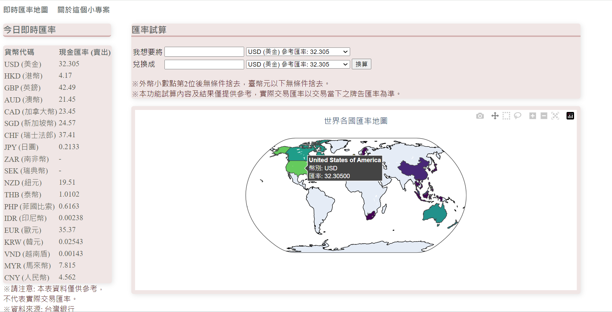

# 專案名稱: 即時匯率地圖

## 專案說明
這是一個即時匯率查詢和匯率換算工具，能在地圖上顯示各國匯率。使用者可以方便地查看各國的匯率，並且當游標移至某國時，即時顯示該國的匯率資訊。

## 使用技術
- **前端**：HTML、CSS、HTMX
- **後端**：Django、爬蟲、Geopandas

## 專案架構與技術說明
- **後端**：
  - **Python + Django**：作為 API 服務，用於處理爬蟲、資料處理和匯率計算。
  - **爬蟲框架**：使用 BeautifulSoup 或 Scrapy 從台灣銀行抓取每日匯率資料，確保資料的準確性和即時更新。
  - **地圖框架**：Geopandas 是基於 Pandas 的資料處理工具，並具備地理空間數據處理功能。使用 GeoDataFrames 來儲存和管理地理空間資訊。

## 功能亮點
- **地圖互動性**：當游標移動到某國家區域時，自動顯示該國的匯率，提升使用者體驗和查詢的便利性。
- **即時匯率換算**：使用 HTMX 即時運算匯率換算結果，無需重新整理頁面即可看到不同幣別間的即時轉換結果。

## 部署尚未完成 (待續)