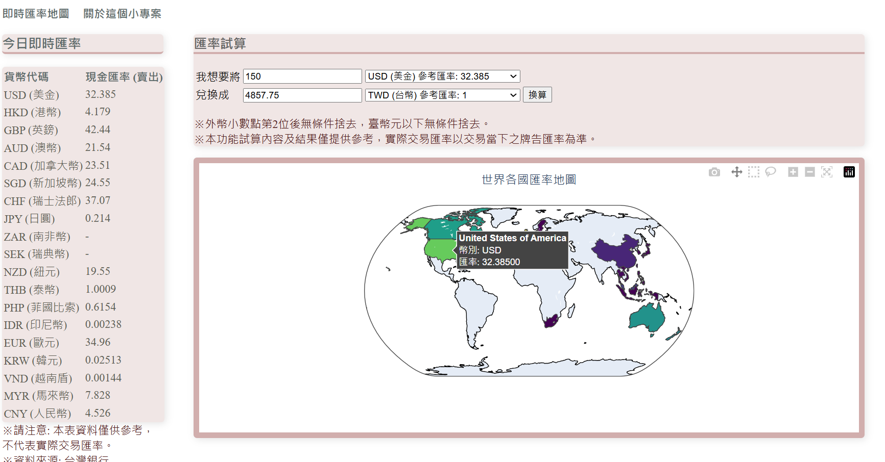
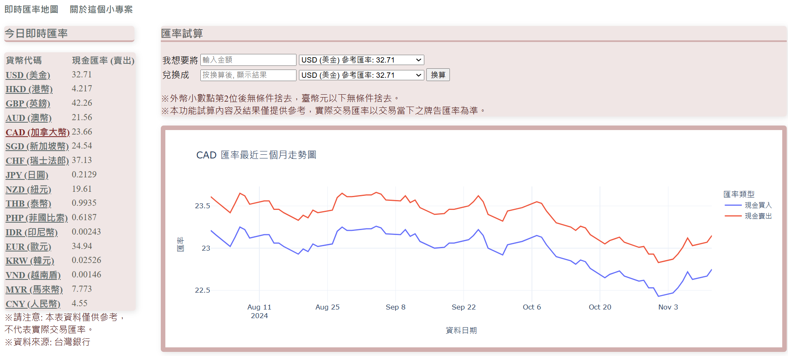
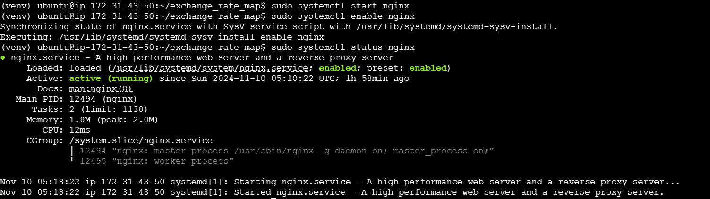

# 專案名稱: 即時匯率地圖

## 專案說明
這是一個即時匯率查詢和匯率換算工具，能在地圖上顯示有告牌匯率的國家。使用者可以方便地查看該國匯率，並且當游標移至某國時，即時顯示該國的匯率資訊。

## 使用技術
- **前端**：HTML、CSS、HTMX
- **後端**：Django、爬蟲、Geopandas

## 專案架構與技術說明
- **後端**：
  - **Python + Django**：作為 API 服務，用於處理爬蟲、資料處理和匯率計算。
  - **爬蟲框架**：使用 BeautifulSoup 從台灣銀行抓取每日匯率資料，確保資料的準確性和即時更新。
  - **地圖框架**：Geopandas 是基於 Pandas 的資料處理工具，並具備地理空間數據處理功能。使用 GeoDataFrames 來儲存和管理地理空間資訊。

## 功能亮點
- **地圖互動性**：當使用者的游標懸停於特定國家區域時，系統將即時顯示該國的匯率資料，為用戶提供即時、直觀的匯率查詢體驗，提升網站的互動性和使用便利性。
- **即時匯率換算**：利用 HTMX 技術，實現即時匯率換算功能。用戶在不需要重新整理頁面的情況下，即可看到不同幣別間的即時換算結果，確保匯率轉換過程流暢快捷，極大提高了使用體驗。
- **匯率近三個月走勢圖**: 通過 HTMX 技術，無需刷新頁面即可即時查看各幣別的近三個月匯率走勢圖。用戶只需選擇幣別，系統將自動顯示該幣別的歷史走勢，幫助用戶掌握市場趨勢，進行更精確的匯率分析。

## 部署尚未完成 (待續)

